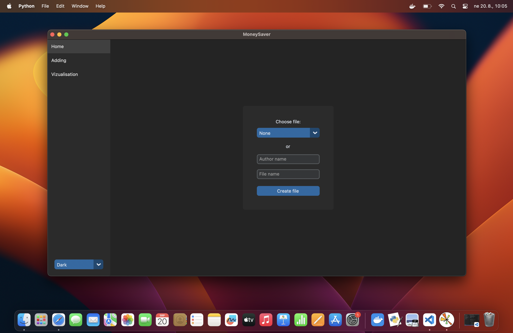
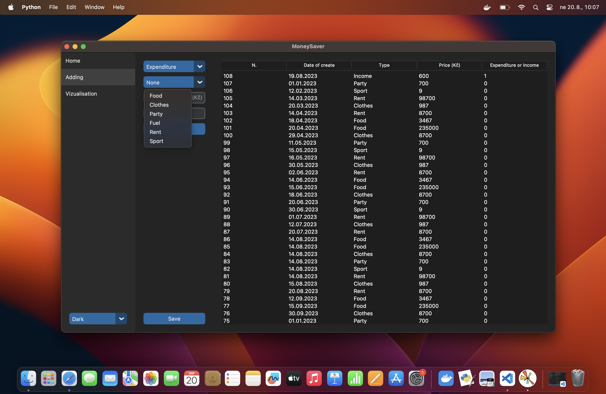
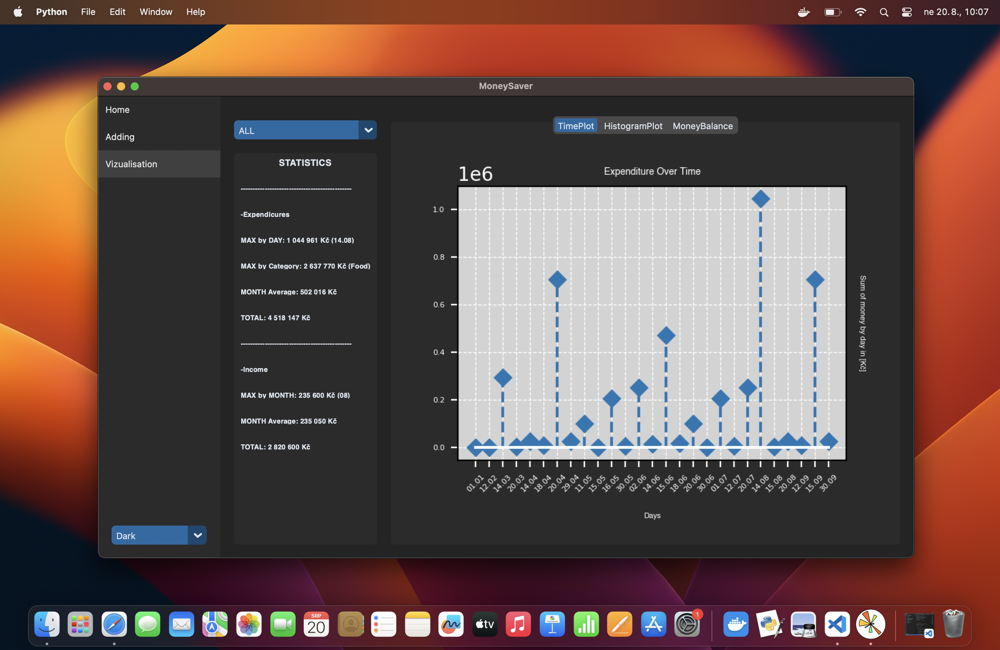
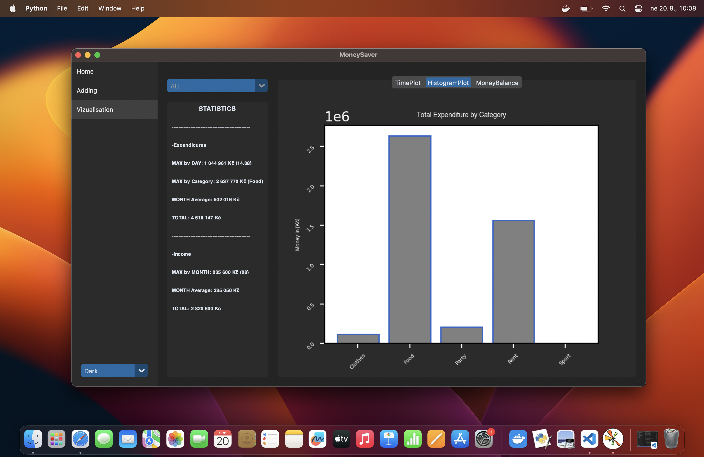
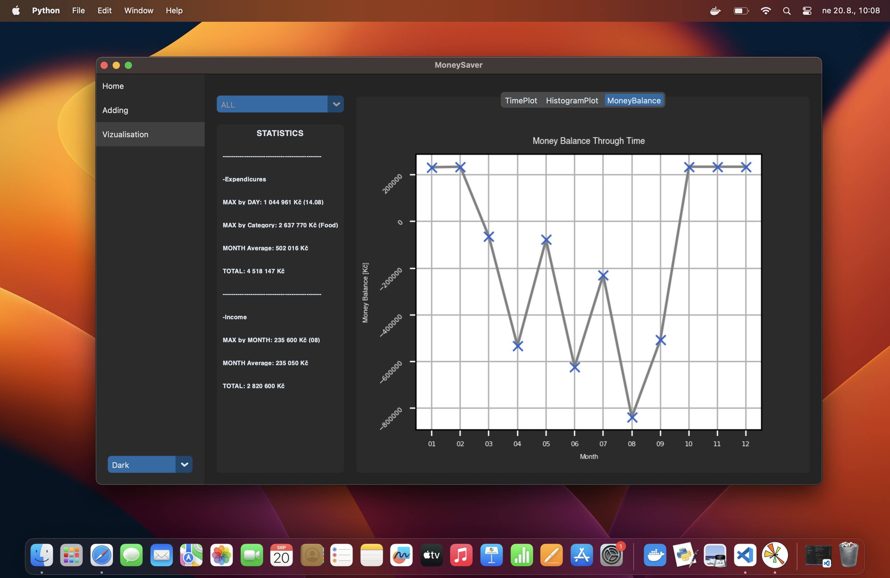

# Cash_Managment_App
My Cash Management App is a user-friendly and feature-rich application designed to help you take control of your finances. Track your income and expenses, visualize your financial data with interactive charts, and monitor your money balance over time.

## Table of Contents

- [Introduction](#introduction)
- [Features](#features)
- [Screenshots](#screenshots)
- [Usage](#usage)
- [Contributions](#contributions)
- [Future Work](#future-work)
- [Contact](#contact)

## Introduction

Welcome to My Cash Management App! This application is designed to help you manage your finances effectively. You can use this app to track your income, expenses, and get insights into your spending patterns.

## Features

- Track income and expenses
- Visualize your financial data with interactive charts
- Monitor your monthly money balance
- Categorize expenses for better analysis

## Screenshots

### HomeFrame

### Adding

### Expenditure Over Time

### Total Expenditure by Category

### Money Balance Through Time

## Usage

1. Launch the app and sign in or create an account.
2. Enter your income and expenses under the 'Add Transaction' tab.
3. View your financial data in various charts under the respective tabs.
4. Monitor your monthly money balance and spending patterns.

## Contributions

Contributions are welcome! If you find any issues or want to add new features, feel free to submit a pull request.

## Future work

Datetime Filtering and Date Visualization:

I aim to introduce a datetime filtering feature, allowing users to selectively visualize data based on specific date ranges. This enhancement will provide users with a more focused view of their financial data, enabling them to analyze trends and patterns more effectively.

Dynamic Currency Conversion:

Another planned functionality is the addition of dynamic currency conversion. Currently, the application supports Czech Crowns as the default currency. However, I plan to implement a feature that will enable users to switch between different currencies, enhancing its global usability and making it adaptable to various financial contexts.

## Contact

- [matousvondal@icloud.com](mailto:matousvondal@icloud.com)
- Visit my LinkedIn: [Link](https://www.linkedin.com/in/matouš-vondál/)

